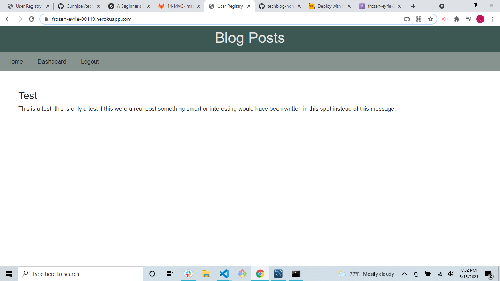

# techblog-homework

Wrote up code for a techblog website deployed view Heroku.
Put together code using mysql and handlebars to make a site that required a password to be accessed.

link: https://frozen-eyrie-00119.herokuapp.com/

screenshot</img>